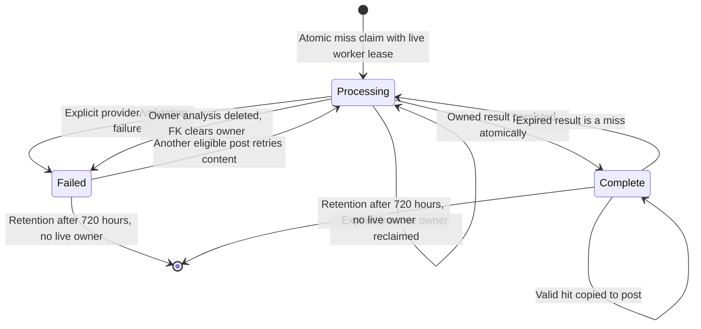

# Production Safety Repair

## Live Rollout Decision (2026-10-05)

The user chose to proceed with the existing live Supabase project, declined a
new test/staging environment, and explicitly accepted proceeding without a
backup. These are accepted operational risks, not successful validation results.
Backup creation is no longer a prerequisite for the user-requested rollout.
Each live write still requires approval of its exact scope; automatic retention
was subsequently approved and enabled as recorded below. Destructive test
execution on the live project remains unauthorized.

The Edge Functions run in Supabase. Repository files are deployment sources;
local edits and tests do not change the hosted functions, schedules or database.

Live catalog output supplied by the user shows `bluesky_posts.published_at` and
`source_url` are NOT NULL without defaults; `fetched_at` is NOT NULL DEFAULT
`now()`; `has_v2_analysis` defaults to false. There is no raw-post `created_at`.
The earlier reconstructed fixture was wrong. All seven pending migrations that
referenced it now use `published_at` directly, and the local-only baseline and
SQL fixtures match the observed raw column types, required fields and defaults.
Do not replay the baseline migration on live. Analysis/cache creation timestamps
remain separate valid fields and are unchanged.

The SQL suite passes against this corrected fixture, including publication-age
retention independent of fetch age, required publication/source enforcement,
automatic `fetched_at` generation through fenced ingestion, and duplicate
insertion prevention. Old nullable-publication fallback claims below are
superseded: null publication dates are invalid in the actual live table.
Native concurrency and cancellation remain unverified. Hosted execution evidence
is limited to the observations recorded below.
The supplied live database has no migration ledger at
`supabase_migrations.schema_migrations`; migration filenames must not be assumed
applied or unapplied without actual object inspection. The initial cron snapshot
is superseded by the final schedule read-back below.

### Live rollout outcome

*Updated: 2026-10-05 - user-supplied SQL Editor results and deployment reports.*

- The user reported deploying both updated Edge Functions through the Supabase
   web editor. Hosted files were flattened to `index.ts`, `costControls.ts` and
   `workerLease.ts`, with `./` imports; repository sources retain `../_shared/`.
- The functionality migrations were applied manually and their objects checked.
   The retention-index migration was only partially applied: some builds timed
   out. Do not blindly replay historical migrations or use `db push` against
   this database without reconciling its absent migration ledger.
- Azure remains unavailable. `LLM_PROCESSING_ENABLED=disabled` was set. An
   authenticated analysis request returned HTTP 200 with zero selected,
   completed and failed, and `skipped: processing disabled`. This proves the
   disabled path only, not successful AI processing or ingestion.
- Further hosted smoke tests were explicitly skipped. Scheduled ingestion and
   dashboard refresh success have not been verified. The frontend deployment
   of the local `app.js` changes has not been confirmed.
- Automatic retention was separately approved; `retention_enabled` was set to
   `true`. Manual bounded cleanup returned raw-post and V2-analysis deletion
   counts with all three audit-log deletion counts zero. The expired raw-post
   backlog fell from 29,492 to 3 at the final check; the cutoff continues moving.
- The user separately approved and reported truncating legacy `post_analyses`
   with `RESTRICT`, preserving its table and dependencies. The requested zero-row
   verification result was not supplied; do not claim independently verified
   emptiness. Raw posts and V2 were not targets of that truncation.
- Regular vacuum on raw posts and V2 completed. After approved job pauses and
   an activity check, the user reported successful `VACUUM (FULL, ANALYZE)` on
   V2 only. SQL read-back showed database size 585 MB -> 475 MB and V2 including
   indexes about 370 MB -> 260 MB. This is about 110 MB reclaimed, not a guarantee
   of the separately measured Supabase quota or future headroom.
- The three paused jobs were restored and their final states read back:

| Job | Schedule | Active |
| --- | --- | --- |
| `ingest-bluesky-ai-coding-posts` | `0 * * * *` | true |
| `dashboard-v2-cache-refresh-safety-net` | `58 * * * *` | true |
| `sentiment-retention-cleanup` | `48 * * * *` | true |
| `analyse-posts-ai-sentiment` | `5-59/10 * * * *` | false |
| `reclaim-stuck-processing-analyses` | `52 * * * *` | false |

Live SQL was run by the user, not by an agent database connection. No backup or
staging environment was used, by explicit user choice. Check subsequent cron
results and platform quota reporting; schedule activation is not execution
success. SQL migrations intentionally keep conservative disabled defaults for
new deployments and do not encode these operator-approved live activations.

### Commit preparation checks

*Updated: 2026-10-05 - local verification after recording the live rollout.*

- Reran the Node compatibility suite: 77/77 Edge tests and browser polling,
   visibility and review-cutoff regressions passed.
- Reran the disposable PGlite SQL suite: retention, permissions, ownership,
   cache recovery, exact completion and reporting regressions passed. This is
   still not native multi-session or cancellation evidence.
- Strict TypeScript passed for 14 files; ESLint correctness checks passed for
   20 files. No runtime code was changed during commit preparation.
- A heuristic credential-pattern scan of the 29 changed/untracked files found
   no candidates. This is not a dedicated secret-scanner guarantee. The existing
   browser publishable key is public configuration, not a service-role secret.
- No GitHub Actions workflows or hosting configuration were found in the local
   tree. GitHub CLI API access returned HTTP 401; `gh auth status` reported an
   invalid saved keyring token. GitHub Pages settings and external deployment
   integrations therefore remain unknown. Do not infer that a push to `main`
   cannot deploy the frontend. Re-authenticate privately before remote checks.

## Pre-rollout verdict (historical)

At the end of local remediation the recommendation was **do not deploy or
enable retention yet**. The user later accepted a live rollout with the gaps
above; that decision does not turn unexecuted tests into passes.
Real PostgreSQL multi-session, crash and cancellation
tests are supplied but could not execute on this workstation: Application Control
blocks PostgreSQL, Device Guard blocks Deno, and WSL is not installed. No policy
was bypassed. The no-production-change/no-deletion status applied only before
the subsequently approved live rollout described above.

This report supersedes conflicting claims in the cost-optimization report and
older README prose. Correctness, not additional savings, drove these changes.

## Issue Status And Reproduction

| Finding | Status | Root cause and implemented prevention | Post-fix reproduction |
| --- | --- | --- | --- |
| 1 Audit deletion | Fixed locally | Cleanup treated run/audit history as disposable. All three log tables are excluded from preview and deletion. | Old retention audit, invocation and refresh log rows survive repeated cleanup; deletion counts are zero. |
| 2 Retention/cache ownership | Partially fixed pending real concurrency test | Ownership existed only implicitly. Bidirectional FKs, explicit owner analysis ID, owner-removal trigger, common transaction lock and live-lease exclusion now coordinate lifecycle. | Live owner survives cleanup; expired owner is deleted, FK clears ownership, next claimant recovers. Ten copies at selection head all finish rather than remaining blocked. Real racing transactions not executed. |
| 3 Expired cache terminal failure | Fixed locally; concurrent race gate pending | Expiry shared the failure branch. Only valid completed cache hits are reused; every expired/ownerless/inactive processing entry is atomically reclaimed. | Expired success and processing both return `claimed`; new post is not terminally failed. Old false-failure rows identified by the exact former error are moved to pending. |
| 4 Completion without persistence | Fixed locally | REST update checked only error, not affected count or ownership. Fenced completion verifies lease, analysis status/token/fence, cache owner, and exactly one row in each update. | Deleted row, replaced worker and already-complete row return zero; suppressed UPDATE raises an exception and leaves both result/cache uncommitted. Edge never reports complete unless RPC returns integer 1. |
| 5 Worker locking | Partially fixed | Start timestamp was a rate gate, not ownership. Renewable 180-second lease, random owner, increasing fence, 120-second local admission deadline and fenced writes replace it. | Duplicate admission denied; forced lease expiry permits higher-fence takeover; stale renewal/release/completion denied. Real overlap and killed-session tests are supplied but unexecuted. |
| 6 Timeout protection | Partially fixed | Per-function timeout was armed too late. Cron now sets caller timeout/lock timeout before SELECT; cleanup refuses absent/oversized settings. | Missing caller settings are rejected. PGlite cannot demonstrate cancellation: a top-level 1 ms bounded probe finished after about 509 ms. Native SQLSTATE 57014 and rollback test remains mandatory. |
| 7 Time semantics | Fixed locally | Calendar-day SQL differed from elapsed JS hours; review omitted null-date fallback. SQL uses 720 hours with UTC functions; review view supplies effective publication time; source timestamps require offset/Z. | Exact boundary survives in UTC, Sydney and New York across spring/fall dates. Null-date recent post appears in both reporting paths. Equivalent offset accepted, missing offset rejected. |

Additional reviewed defects addressed: legacy parent FK added `NOT VALID` (new
orphans rejected without deleting existing ones); stale dashboard generations
older than 90 minutes fail explicitly; fixed hourly browser polling no longer
skips alternate ticks; cache hash now includes the exact full provider request.

## Ownership Design

### Choice And Justification

- `pipeline_run_state` stores random `owner_token`, increasing `fence` and
  database-clock `lease_until`, separately from cadence. The table is bounded;
  rows/fences must not be reset during rollout.
- Acquisition, renewal, release, analysis claims, result commits, recovery,
  ingestion commits and retention use advisory transaction lock `78123901`.
  It serializes only short database transitions, not HTTP calls. At this workload
  one lock is simpler to reason about than several lock orders. It is released
  automatically on rollback, session failure or transaction completion.
- A session advisory lock cannot protect Edge HTTP work through transaction
  pooling. A lease survives connection boundaries. Fencing rejects late writes
  after expiry, release, restart or takeover, even if an old process resumes.
- Renewal extends only a currently valid owner/fence; expired leases cannot be
  resurrected. Acquisition also honors the collection/analysis cadence. Crash
  recovery may wait until the next cadence slot, not only until lease expiry.
- New worker direct INSERT/UPDATE/DELETE/TRUNCATE grants are revoked, as are old
  unfenced claim/admission RPC permissions. Supabase service_role bypasses RLS
  but still requires SQL privileges. All new write RPCs are service-role-only
  SECURITY DEFINER with fixed search paths. Old workers therefore fail closed.
- Shared APIs retain public reporting schemas. The internal write contract
  changes necessarily: supporting old unfenced writes would defeat protection.

```mermaid
sequenceDiagram
    participant A as Worker A
    participant DB as PostgreSQL
    participant AI as Provider
    participant B as Worker B
    A->>DB: Acquire(owner A), fence 10, lease 180s
    A->>DB: Claim post/cache, renew lease
    A->>AI: Bounded request
    B->>DB: Acquire while A valid
    DB-->>B: Not admitted
    Note over A,DB: Crash or pause; lease expires
    B->>DB: Acquire(owner B), fence 11
    B->>DB: Reclaim inactive processing owner
    A->>DB: Late completion(fence 10)
    DB-->>A: 0 rows; no success
    B->>AI: Retry if result is unavailable
    B->>DB: Finish(fence 11), analysis and cache transaction
    DB-->>B: Exactly 1 persisted result
```

**Guarantee boundary:** one valid lease owner and one accepted committed result,
not the physical impossibility of two paused processes existing simultaneously.
Foundry has no configured idempotency/fencing facility. A crash after a paid call
but before commit may cause a later retry and duplicate charge. Lease fencing
prevents stale database writes, not an already-sent external request. Do not
claim exactly-once external calls or zero physical process overlap.

### Cache State Transitions



Cache failed state does not automatically fail another post. An explicit failed
post itself remains failed unless deliberately retried by an operator. Abandoned
processing becomes pending or is reclaimed by the next owner. Raw analysis
markers remain for compatibility but are no longer the authority for eligibility.
Full request hashing includes system/user messages, structured schema, settings,
deployment, configured model revision, endpoint and prompt version. Operators
must change the model revision or prompt version when swapping a model in place.

```mermaid
sequenceDiagram
    participant R as Retention
    participant DB as PostgreSQL
    participant W as Worker
    R->>DB: Caller timeouts, transaction lock
    DB->>DB: Select expired parents excluding live analysis owners
    DB->>DB: Delete inactive child analyses
    DB->>DB: FK clears cache owner; trigger makes entry reclaimable
    DB->>DB: Delete parents after children; preserve audit tables
    DB-->>R: Counts and committed audit entry
    W->>DB: Acquire lease and claim matching recent content
    DB-->>W: Reclaimed cache miss, not permanent skip
```

### Failure Scenarios

| Event | Result |
| --- | --- |
| Worker stops before claiming | Lease expires; no post is owned. |
| Worker stops after claiming | Lease-aware selection/recovery reoffers the pending work; next fence owns it. |
| Worker stops after external response | No fabricated success; retry may cost another call. |
| Old worker returns after takeover | Token/fence/lease checks deny mutation. |
| Result update is suppressed or cache update fails | Entire transaction rolls back; no success receipt. |
| Retention meets a live owner | Parent and analysis are preserved past cutoff until inactive. |
| Retention deletes inactive owner | FK clears cache owner and trigger makes it reclaimable. |
| Cleanup is interrupted | Transaction must roll back deletes and audit insert together; native cancellation test is the gate. |
| Unknown incoming FK or delete trigger exists | Cleanup raises an error rather than risking a protected cascade. |

## Retention And Time Policy

Never delete `retention_cleanup_log`, `analyse_posts_invocation_log`, or
`dashboard_v2_cache_refresh_log` through this cleanup. They are operational/audit
history with indefinite retention until a separately approved archival policy.
Configuration, auth, billing, user-managed, reference and dashboard aggregate
tables are not cleanup targets. Existing three-generation dashboard replacement
remains separate from raw-data retention.

Disposable targets: raw posts, their V2/legacy analyses, old legacy orphans, and
old inactive content-cache entries. Publication time falls back to raw creation
time. Legacy orphans use their creation time. All cutoffs are exactly 720 elapsed
hours. The comparison is strict `<`; exactly-at-cutoff records survive. Live
ownership can extend retention beyond the cutoff. Existing orphan rows are not
silently deleted by the FK migration; later approved cleanup handles old ones.

Cleanup remains disabled by setting and cron flag. Its newest migration resets
the setting false. The cron command must execute these as caller statements:

```sql
SET statement_timeout = '60s';
SET lock_timeout = '2s';
SET timezone = 'UTC';
SELECT public.cleanup_sentiment_history(1000);
```

The function has no misleading function-local statement timeout. It checks the
caller's settings and fails closed unless both bounds are positive and within
the required maximums. This check does not prove a backend implements timers;
the native cancellation test must run. Preview is read-only; deletion stays
transactional/batched. Full-table plans can still occur for bounded deletes;
production EXPLAIN/lock budgets remain necessary, not an optimization claim.

## Test Gap Analysis

| Finding | Why previous tests missed it | New coverage |
| --- | --- | --- |
| Audit loss | Tests expected trimming rather than protected history | Old rows in every log table; repeated cleanup preserves them |
| Ownership loss | Retention and cache tested separately, no live/crashed owner | Live owner exclusion; deletion/FK transition; ten-copy starvation reproduction |
| Cache expiry | Only fresh hit/miss fixtures | Expired successful and processing cache; old false-failure recovery; competing claims in native runner |
| False completion | REST mocks returned error-null without affected counts | Zero return; deleted row; replaced token; suppressed update trigger; rollback checks |
| Worker overlap | Sequential admission mistaken for concurrency | Valid/expired lease, monotonic fence, stale renew/release/finish; real two-session lock race and backend kill supplied |
| Timeout | Configuration text mistaken for executed cancellation | Missing settings refused; native slow-audit trigger forces timeout after deletes and verifies rollback/retry |
| DST/null timestamps | UTC-only fixtures, browser cutoff not compared with SQL | Multiple zones, spring/fall dates, exact boundary, explicit offsets and view parity |
| Polling | No elapsed response time in timer test | Simulated one-second response at consecutive hourly ticks |

Executed here: `test-cost-controls.mjs` including `test-production-safety.mjs`,
77 Edge tests via the Node adapter, browser logic regressions, strict TypeScript
for 14 files and ESLint correctness rules for 20 files. Every new non-cron safety
migration is applied twice. These tests execute actual PostgreSQL SQL in PGlite
but **not simultaneous sessions or functioning cancellation timers**.

Run on a permitted machine against an empty disposable local PostgreSQL database:

```powershell
# Provision an empty database named sentiment_safety_<unique_suffix> locally.
# Configure SAFETY_TEST_DATABASE_URL privately; never commit credentials.
node supabase/scripts/test-concurrency-postgres.mjs
```

The runner accepts only loopback addresses and that database-name prefix, and
refuses non-empty databases. It installs fixture schemas, so this is not a
read-only production check. It tests two-session blocking, competing cache claims,
retention exclusion, higher-fence takeover, killed-backend recovery, stale
ingestion denial, and actual SQLSTATE 57014 cancellation with rollback and retry.
Install `pg` alongside the documented temporary validation dependencies. No
PostgreSQL install-script approval or execution-policy override is required or
recommended by the runner. Local Application Control prevented executing it here.

## Changes

- [Fenced pipeline migration](supabase/migrations/20261005100000_fenced_pipeline.sql): leases, ownership FKs, guarded claims/completion/ingestion/recovery, write privileges.
- [Safe retention migration](supabase/migrations/20261005101000_safe_retention.sql): audit protection, ownership exclusion, caller guards and UTC.
- [Caller timeout migration](supabase/migrations/20261005102000_retention_caller_timeout.sql): inactive cron with caller SET statements.
- [UTC reporting migration](supabase/migrations/20261005103000_utc_reporting.sql): effective publication timestamp, UTC aggregation and stale generation rejection.
- [Lease helper](supabase/functions/_shared/workerLease.ts) and both [analysis](supabase/functions/analyse-posts/index.ts) / [ingestion](supabase/functions/ingest-bluesky-search/index.ts) workers: fenced lifecycle and bounded HTTP.
- [Shared controls](supabase/functions/_shared/costControls.ts) and [browser](app.js): explicit timestamps, server cutoff and stable scheduled polling.
- [SQL regressions](supabase/scripts/test-production-safety.mjs), [native race runner](supabase/scripts/test-concurrency-postgres.mjs), [lease tests](supabase/functions/_shared/workerLease.test.ts), existing batch/ingestion tests and Node runner.
- Earlier unapplied retention migration excludes audit logs too; existing test fixture expectations changed accordingly. Older deployed migrations were not executed.
- README, cost report and [operator SQL](supabase/scripts/retention-operations.sql) point to this policy.

## Rollout And Remaining Risks

1. Keep production jobs and retention disabled. Obtain approval for any hosted
   change. Inventory all cron commands/roles, unexpected triggers/FKs, backups,
   grants, deployed worker versions and migration history.
2. Pass native Deno and the real PostgreSQL runner on a permitted machine, then
   staging Supabase pg_cron/pg_net tests. Inspect actual cron timeout command and
   prove a canceled cleanup rolls back. Validate table-owner and service_role
   privileges in staging; tests here cannot reproduce hosted custom grants.
3. Pause old workers and drain in-flight work. Apply safety migrations in order;
   deploy both new workers before resuming. Revoked legacy write paths deliberately
   reject an old worker. No dual-writing compatibility mode exists.
4. Inspect existing legacy orphans and explicitly validate the new FK after a
   separately approved remediation. `NOT VALID` preserves old data while enforcing
   new writes. Do not broadly replay reconstructed baseline migrations.
5. Refresh dashboard once with approval. Validate counts/null dates/cache age,
   then resume ingestion/analysis. Monitor lease losses, recoveries and provider
   calls. Do not assume old cost ceilings represent crash-retry spending.
6. Run preview and review deletion counts. Only enable retention after native
   cancellation/concurrency and staging tests pass and the operator approves it.
7. Rollback means pause, disable cleanup, and deploy a reviewed compatibility
   change if returning to old workers. Do not simply restore their table grants:
   that removes fencing. Additive data may remain. Committed deletions require
   backups to restore; disabling a job cannot cancel an already-running transaction.

No claim of full production readiness is made. Remaining gates: true concurrency,
actual cancellation, Supabase runtime behavior, deployed permissions/jobs, SQL
plans at hosted scale, and external provider idempotency limitations. Existing
functions can still explicitly fail individual inputs; cached expiry alone can
no longer do so. Audit logs intentionally grow until archival is separately approved.